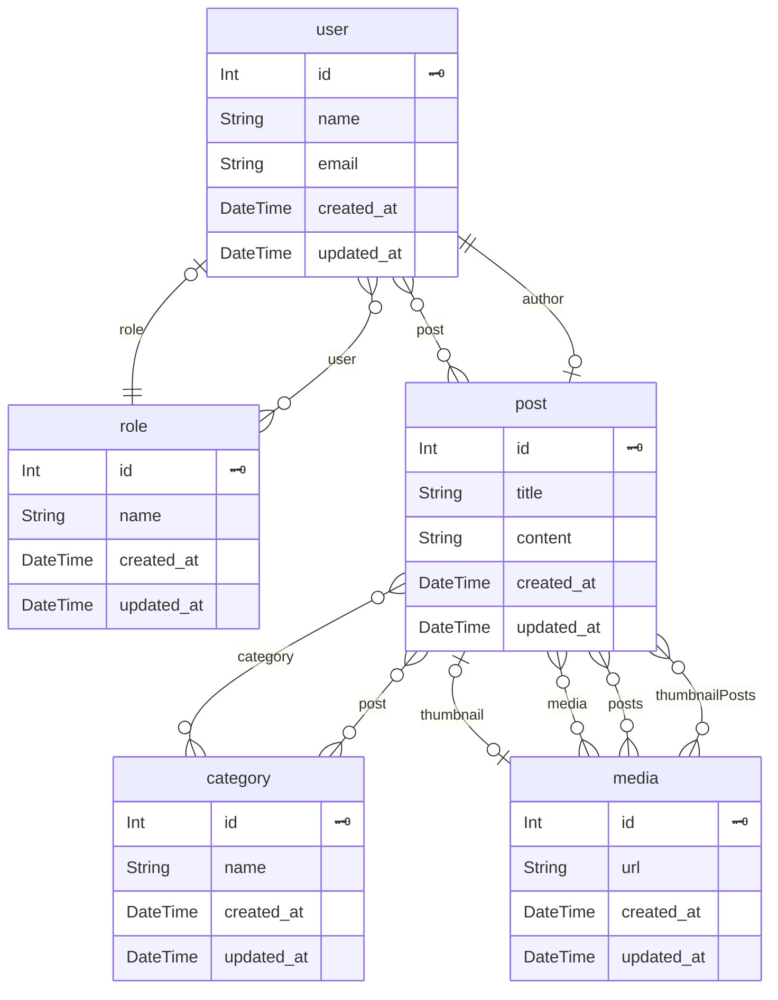

```mermaid
erDiagram

  "user" {
    Int id "🗝️"
    String name
    String email
    DateTime created_at
    DateTime updated_at
    }

  "role" {
    Int id "🗝️"
    String name
    DateTime created_at
    DateTime updated_at
    }

  "post" {
    Int id "🗝️"
    String title
    String content
    DateTime created_at
    DateTime updated_at
    }

  "category" {
    Int id "🗝️"
    String name
    DateTime created_at
    DateTime updated_at
    }

  "media" {
    Int id "🗝️"
    String url
    DateTime created_at
    DateTime updated_at
    }

    "user" o|--|| "role" : "role"
    "user" o{--}o "post" : "post"
    "role" o{--}o "user" : "user"
    "post" o|--|| "user" : "author"
    "post" o{--}o "category" : "category"
    "post" o|--|o "media" : "thumbnail"
    "post" o{--}o "media" : "media"
    "category" o{--}o "post" : "post"
    "media" o{--}o "post" : "posts"
    "media" o{--}o "post" : "thumbnailPosts"
```
