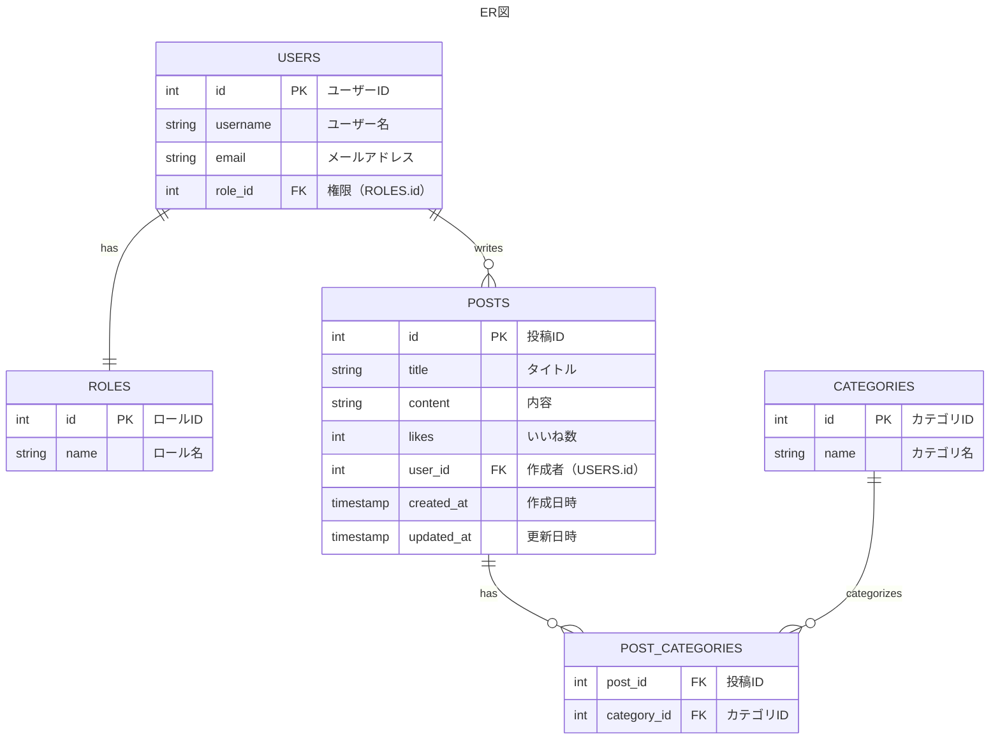

```mermaid
---
title: "ER図"
---
erDiagram
    USERS ||--|| ROLES : "has"

    USERS {
        int id PK "ユーザーID"
        string username "ユーザー名"
        string email "メールアドレス"
        int role_id FK "権限（ROLES.id）"
    }
    ROLES {
        int id PK "ロールID"
        string name "ロール名"
    }

    USERS ||--o{ POSTS : "writes"
    POSTS ||--o{ POST_CATEGORIES : "has"
    POSTS {
        int id PK "投稿ID"
        string title "タイトル"
        string content "内容"
        int likes "いいね数"
        int user_id FK "作成者（USERS.id）"
        timestamp created_at "作成日時"
        timestamp updated_at "更新日時"
    }
    CATEGORIES ||--o{ POST_CATEGORIES : "categorizes"
    CATEGORIES {
        int id PK "カテゴリID"
        string name "カテゴリ名"
    }
    POST_CATEGORIES {
        int post_id FK "投稿ID"
        int category_id FK "カテゴリID"
    }
```
